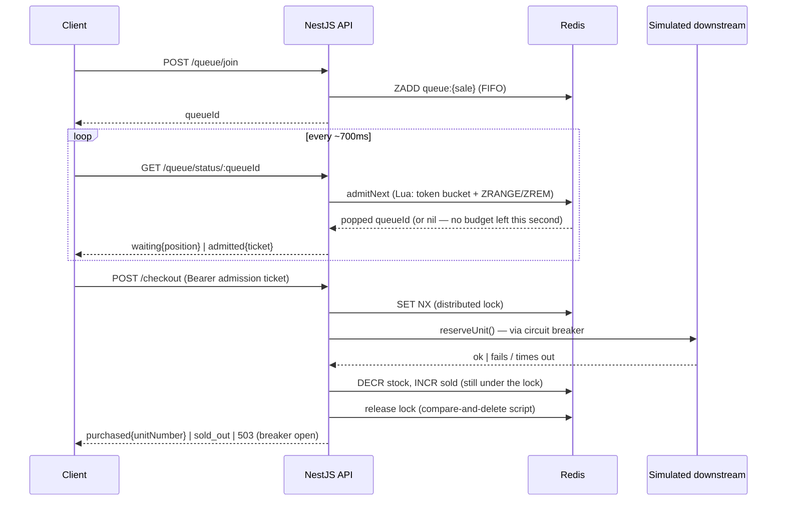

# flash-sale-queue

A standalone, generic version of the rate-limiting core I built for a real ticketing platform (a multi-tenant SaaS handling high-demand on-sales — see [my portfolio](https://pedro-terraf-sigma.vercel.app/#projects)): a Redis-backed virtual waiting room, a single-node distributed lock protecting a stock decrement, and a fail-closed circuit breaker around a simulated downstream dependency.

That project's code is private client work, so nobody outside the team could ever verify the numbers I put on my CV. This repo is the opposite: it's public, it's small enough to read end-to-end, and it ships with a **real, reproducible load test** — clone it, run it, get your own numbers.

## Live demo

```bash
docker compose up -d --build     # Redis + NestJS API on :3001
cd frontend && npm install && npm run dev   # Next.js UI on :3000
```

Open two browser tabs on `http://localhost:3000` and hit **Join queue** on both — watch the position counter, then flip **Simulate downstream outage** and watch the circuit-breaker badge trip open and recover on its own a few seconds later.

## Architecture



**Why a distributed lock *and* a Lua-scripted admission gate, not just Redis's own atomicity?** A single `INCR`/`DECR` is already atomic, but real checkout needs more than one Redis round-trip inside the same critical section (check stock → call the downstream dependency → decrement) — that's exactly the class of bug a bare atomic command can't prevent. The lock here is a **single-node** `SET NX PX` + compare-and-delete release script, deliberately *not* the multi-node Redlock algorithm — one Redis instance is enough to demonstrate (and load-test) the pattern honestly; Redlock solves a different problem (surviving a Redis node failure mid-lock) that a single-instance demo doesn't have.

## What's actually being demonstrated

- **Virtual waiting room** — a Redis sorted set (`ZADD`/`ZRANK`) keeps strict join order. Admission is driven by an **atomic Lua script** (`admitNext`) that checks a per-second token-bucket key before popping the front of the queue — see "What the load test caught" below for why it has to be atomic.
- **JWT admission tickets** — once let through, a client gets a short-lived signed ticket; `/checkout` is behind a guard that rejects anything without a valid one. The queue is meaningless if checkout is reachable directly, so this is enforced server-side, not by "being polite" in the frontend.
- **Distributed lock** — `checkout/distributed-lock.service.ts`. `SET key token NX PX ttl` to acquire, a Lua compare-and-delete to release (so a slow request can never delete a *different* request's lock after its own expired).
- **Fail-closed circuit breaker** ([opossum](https://github.com/nodeshift/opossum)) around the simulated downstream call in `checkout.service.ts`. Trip it live via `POST /admin/chaos` (or the UI toggle) — after a handful of failures it opens and starts rejecting fast instead of piling up timeouts on an already-unhealthy dependency, then half-opens and recovers on its own.

## What the load test caught

The first cut of the admission gate computed eligibility as `elapsedSeconds * ratePerSecond` compared against each client's queue rank — a "cumulative quota" model. It looked correct and passed manual testing. Running `load-test/run.js` against it with 600 concurrent pollers told a different story:

> observed checkout rate: **avg 120.0/s, peak 229/s** — against a configured cap of **20/s**.

The bug: that formula bounds the *average* rate over time, but not the *burst size*. If a backlog of already-eligible clients all happen to poll in the same instant (exactly what 600 concurrent users hammering the API do), they all pass the check simultaneously and get admitted in one go — the average comes out right, but the checkout endpoint still sees a spike, which defeats the entire point of the pattern.

The fix was to move the *admission decision itself* into the Redis Lua script (`admitNext`): every poll from every client attempts to pop exactly one person off the front of the queue, gated by a per-second counter that's incremented atomically inside the same script. No matter how many clients poll concurrently, only `rate` pops can succeed in any given second — full results below.

A second bug surfaced while re-verifying end-to-end after the fix above, by simply calling `/checkout` twice with the same admission ticket: **it bought two units**. The JWT signature was valid both times — a JWT alone doesn't know it's already been spent. Fixed by tying the ticket to a Redis key that `AdmissionGuard` checks on every request and `CheckoutService` deletes the moment a purchase attempt reaches a definitive outcome (bought or genuinely sold out). A transient failure — the breaker being open, say — deliberately leaves the ticket alone so the client can retry; only a real purchase attempt burns it. Verified: replaying a spent ticket now gets `401 "already used"`, and a ticket that hit a `503` during a simulated outage still works once the outage clears.

## Load test

No k6/Artillery dependency — `load-test/run.js` is a ~150-line Node 18+ script (built-in `fetch`, zero deps) that measures two different things:

1. **Can the front door absorb a stampede?** Fire thousands of concurrent `/queue/join` requests and check the API doesn't fall over.
2. **Does the protected endpoint actually stay capped?** Poll hundreds of users to admission and checkout, then measure the *realized* checkout rate over time against the configured cap.

```bash
docker compose up -d --build
node load-test/run.js
```

Real results from this repo, on a single dev machine (Docker Desktop, 300 stock config raised to 1000 and rate raised to 20/s just for this run so it finishes in reasonable time — see script for env vars):

```
Phase 1 — join storm: 2000 concurrent /queue/join
  p50: 53ms   p95: 164ms   p99: 172ms   errors: 0
  sustained ~1,259 req/s

Phase 2 — rate enforcement: 600 users, join → poll → checkout
  observed checkout rate: avg 20.7/s, peak 40/s   (configured cap: 20/s)
  /checkout latency once admitted — p50: 68ms  p95: 98ms  p99: 99ms
```

The average lands almost exactly on the configured rate; the per-second peak (40 vs. 20) is checkout-completion jitter — some requests admitted in second *N* finish just after the second boundary — not an admission-side burst (that's exactly the bug described above, now fixed and verified). Re-run yourself with `node load-test/run.js` — numbers will vary a little by machine, but the average should always track the configured rate closely.

## Stack

NestJS · TypeScript · Redis (ioredis) · JWT · [opossum](https://github.com/nodeshift/opossum) circuit breaker · Next.js 15 · Tailwind · Docker Compose

## Project layout

```
backend/     NestJS API — queue, checkout, inventory, circuit breaker, stats     (see backend/README.md)
frontend/    Next.js demo UI — join flow, live stats panel, chaos toggle         (see frontend/README.md)
load-test/   Standalone Node load-test harness + real captured results (above)  (see load-test/README.md)
```
