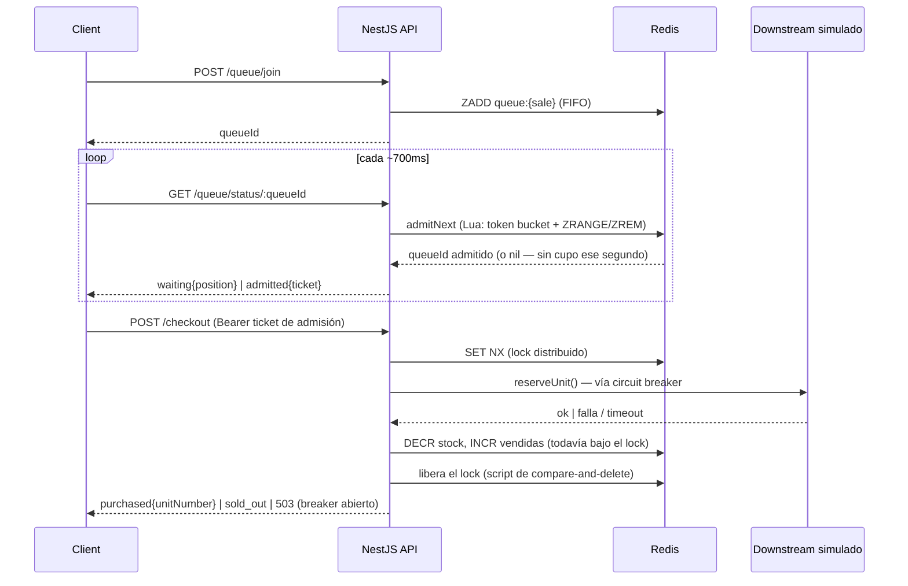

# flash-sale-queue

Versión standalone y genérica del núcleo de rate-limiting que construí para una plataforma de ticketing real (un SaaS multi-tenant que maneja ventas de alta demanda — ver [mi portfolio](https://pedro-terraf-sigma.vercel.app/#projects)): una sala de espera virtual con Redis, un lock distribuido de un solo nodo protegiendo el descuento de stock, y un circuit breaker fail-closed alrededor de una dependencia downstream simulada.

El código de ese proyecto es trabajo privado de cliente, así que nadie fuera del equipo podía verificar los números que puse en mi CV. Este repo es lo opuesto: es público, es lo suficientemente chico para leerlo de punta a punta, y viene con un **load test real y reproducible** — clonalo, correlo, y sacá tus propios números.

## Demo en vivo

```bash
docker compose up -d --build     # Redis + API NestJS en :3001
cd frontend && npm install && npm run dev   # UI Next.js en :3000
```

Abrí dos pestañas en `http://localhost:3000` y apretá **Unirme a la cola** en ambas — mirá el contador de posición, después activá **Simular caída downstream** y mirá cómo la etiqueta del circuit breaker se abre y se recupera sola unos segundos después.

### Detalle de Windows

En Windows con Docker Desktop (backend WSL2), el mapeo de puertos del contenedor de la API solo responde de forma confiable por IPv4 — `[::1]:3001` (loopback IPv6) simplemente se cuelga. Como Chrome/Edge resuelven `localhost` a `::1` primero, las llamadas del frontend a la API pueden quedarse colgadas en silencio aunque `docker compose ps` diga que todo está sano. Por eso el frontend habla con `127.0.0.1:3001` en vez de `localhost:3001` (ver `frontend/lib/api.ts`) — si en algún momento cambiás `NEXT_PUBLIC_API_URL` a mano, usá un literal IPv4, no `localhost`, en Windows.

## Arquitectura



**¿Por qué un lock distribuido *y* un gate de admisión con Lua, y no solo la atomicidad propia de Redis?** Un `INCR`/`DECR` ya es atómico, pero el checkout real necesita más de un viaje a Redis dentro de la misma sección crítica (chequear stock → llamar a la dependencia downstream → descontar) — exactamente el tipo de bug que un comando atómico suelto no puede evitar. El lock acá es **de un solo nodo** (`SET NX PX` + script de compare-and-delete para liberar), deliberadamente *no* el algoritmo Redlock multi-nodo — una sola instancia de Redis alcanza para demostrar (y probar con load test) el patrón de forma honesta; Redlock resuelve un problema distinto (sobrevivir a la caída de un nodo de Redis en medio de un lock) que una demo de una sola instancia no tiene.

## Qué se está demostrando en realidad

- **Sala de espera virtual** — un sorted set de Redis (`ZADD`/`ZRANK`) mantiene el orden de llegada estricto. La admisión la maneja un **script Lua atómico** (`admitNext`) que chequea una key de token-bucket por segundo antes de sacar al primero de la cola — ver "Qué encontró el load test" más abajo para entender por qué tiene que ser atómico.
- **Tickets de admisión JWT** — una vez que pasás, el cliente recibe un ticket firmado de corta duración; `/checkout` está detrás de un guard que rechaza cualquier cosa sin uno válido. La cola no sirve de nada si se puede llegar al checkout directamente, así que esto se aplica del lado del servidor, no "por las buenas" en el frontend.
- **Lock distribuido** — `checkout/distributed-lock.service.ts`. `SET key token NX PX ttl` para adquirirlo, un compare-and-delete en Lua para liberarlo (para que un request lento nunca borre el lock de *otro* request después de que el suyo ya expiró).
- **Circuit breaker fail-closed** ([opossum](https://github.com/nodeshift/opossum)) alrededor de la llamada downstream simulada en `checkout.service.ts`. Se dispara en vivo con `POST /admin/chaos` (o el toggle de la UI) — después de unas pocas fallas se abre y empieza a rechazar rápido en vez de acumular timeouts sobre una dependencia ya no sana, y después pasa a semiabierto y se recupera solo.

## Qué encontró el load test

La primera versión del gate de admisión calculaba la elegibilidad como `segundosTranscurridos * tasaPorSegundo` comparado contra la posición de cada cliente en la cola — un modelo de "cupo acumulado". Se veía correcto y pasó las pruebas manuales. Correr `load-test/run.js` con 600 pollers concurrentes contó otra historia:

> tasa de checkout observada: **promedio 120.0/s, pico 229/s** — contra un límite configurado de **20/s**.

El bug: esa fórmula acota la tasa *promedio* en el tiempo, pero no el *tamaño de la ráfaga*. Si un montón de clientes ya elegibles pollean todos en el mismo instante (justo lo que hacen 600 usuarios concurrentes golpeando la API), todos pasan el chequeo al mismo tiempo y se admiten de una — el promedio sale bien, pero el checkout igual ve un pico, lo que arruina todo el sentido del patrón.

El arreglo fue mover *la decisión de admisión en sí* al script Lua de Redis (`admitNext`): cada poll de cada cliente intenta sacar exactamente una persona del frente de la cola, limitado por un contador por segundo que se incrementa de forma atómica dentro del mismo script. No importa cuántos clientes pollean a la vez, solo pueden tener éxito `rate` extracciones en cualquier segundo dado — resultados completos más abajo.

Un segundo bug apareció al re-verificar todo de punta a punta después del arreglo anterior, simplemente llamando a `/checkout` dos veces con el mismo ticket de admisión: **compró dos unidades**. La firma del JWT era válida las dos veces — un JWT solo no sabe que ya fue usado. Se arregló atando el ticket a una key de Redis que `AdmissionGuard` chequea en cada request y que `CheckoutService` borra en el momento en que un intento de compra llega a un resultado definitivo (comprado o realmente agotado). Una falla transitoria — que el breaker esté abierto, por ejemplo — deliberadamente deja el ticket intacto para que el cliente pueda reintentar; solo un intento de compra real lo consume. Verificado: repetir un ticket ya usado ahora da `401 "ya fue usado"`, y un ticket que chocó con un `503` durante una caída simulada sigue funcionando una vez que la caída termina.

Un tercer bug apareció recién al armar el gráfico de admisiones por segundo (ver más abajo): las keys del token-bucket tenían un TTL de apenas 2 segundos — pensado solo para que no se acumularan para siempre — pero eso significaba que los datos desaparecían de Redis casi al instante, antes de que nada pudiera leerlos después del hecho. La tasa de admisión seguía siendo correcta (el bug no afectaba el rate-limiting en sí, que solo necesita la key durante su propio segundo), pero el endpoint `/stats/timeseries` y el gráfico en vivo mostraban todo en cero. Se arregló subiendo ese TTL a 130 segundos, suficiente para cubrir la ventana del gráfico.

## Load test

Sin dependencia de k6/Artillery — `load-test/run.js` es un script de ~150 líneas en Node 18+ (`fetch` nativo, cero dependencias) que mide dos cosas distintas:

1. **¿La puerta de entrada aguanta una estampida?** Dispara miles de requests concurrentes a `/queue/join` y chequea que la API no se caiga.
2. **¿El endpoint protegido realmente se mantiene acotado?** Pollea a cientos de usuarios hasta la admisión y el checkout, y mide la tasa de checkout *real* en el tiempo contra el límite configurado.

```bash
docker compose up -d --build
node load-test/run.js
```

Resultados reales de este repo, en una máquina de desarrollo (Docker Desktop, config de 300 de stock subida a 1000 y tasa subida a 20/s solo para esta corrida, para que termine en un tiempo razonable — ver el script para las variables de entorno):

```
Fase 1 — tormenta de joins: 2000 /queue/join concurrentes
  p50: 53ms   p95: 164ms   p99: 172ms   errores: 0
  ~1.259 req/s sostenidos

Fase 2 — cumplimiento de la tasa: 600 usuarios, join → poll → checkout
  tasa de checkout observada: promedio 20.7/s, pico 40/s   (límite configurado: 20/s)
  latencia de /checkout una vez admitido — p50: 68ms  p95: 98ms  p99: 99ms
```

El promedio cae casi exacto sobre la tasa configurada; el pico por segundo (40 vs. 20) es jitter de finalización del checkout — algunos requests admitidos en el segundo *N* terminan justo después del límite del segundo — no una ráfaga del lado de la admisión (ese es exactamente el bug descripto arriba, ya arreglado y verificado). Corré el test vos mismo con `node load-test/run.js` — los números van a variar un poco según la máquina, pero el promedio siempre debería acercarse bastante a la tasa configurada.

## Dashboard en vivo

Además del flujo de compra, la demo tiene un panel de estado en tiempo real: stock disponible con barra de progreso, profundidad de cola, admitidos, vendidas, salud de Redis, y el estado del circuit breaker con badge de color (verde = cerrado, ámbar = semiabierto, rojo = abierto). Debajo hay un **gráfico de barras de admisiones por segundo** (los últimos 30s) con una línea de referencia punteada en la tasa configurada y tooltip al pasar el mouse — construido a mano en SVG, sin librería de gráficos, leyendo directamente las mismas keys de token-bucket que usa el limitador de tasa real (no una métrica separada que se pueda desincronizar de lo que pasó de verdad).

## Stack

NestJS · TypeScript · Redis (ioredis) · JWT · circuit breaker [opossum](https://github.com/nodeshift/opossum) · Next.js 15 · Tailwind · Docker Compose

## Estructura del proyecto

```
backend/     API NestJS — queue, checkout, inventory, circuit breaker, stats     (ver backend/README.md)
frontend/    UI de demo en Next.js — flujo de compra, panel de stats, toggle de caos  (ver frontend/README.md)
load-test/   Harness de load test en Node + resultados reales capturados (arriba)     (ver load-test/README.md)
```
